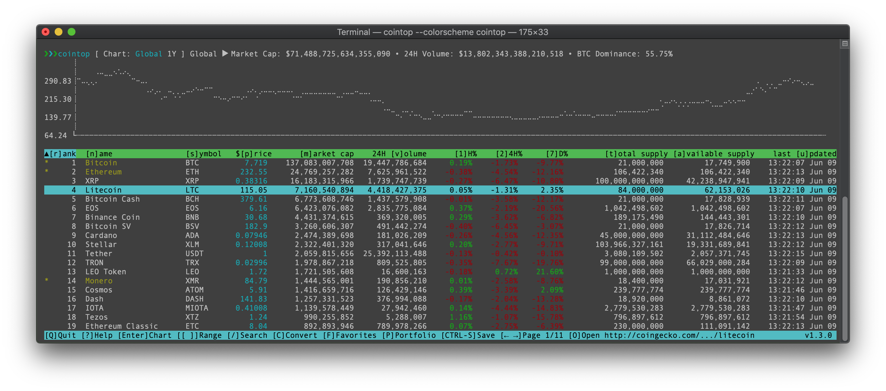
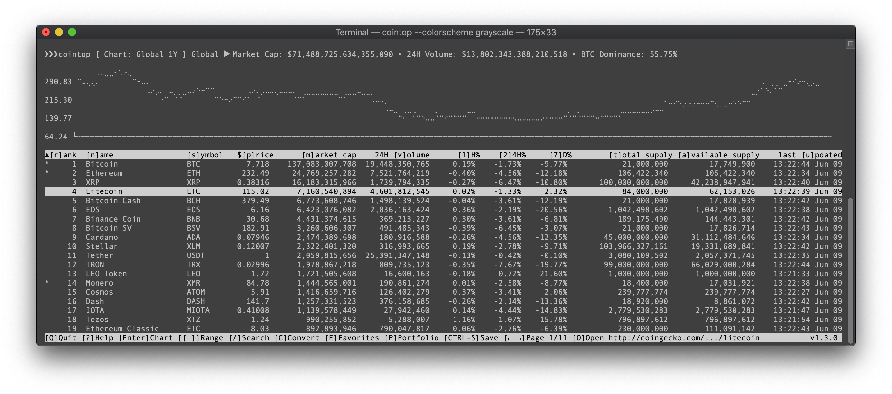
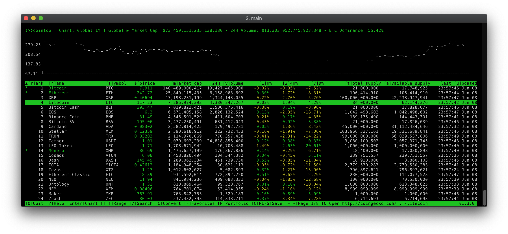
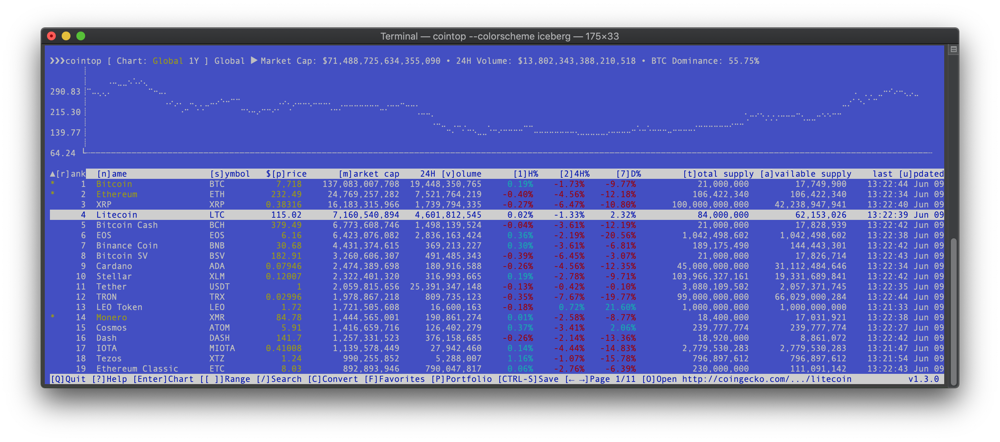
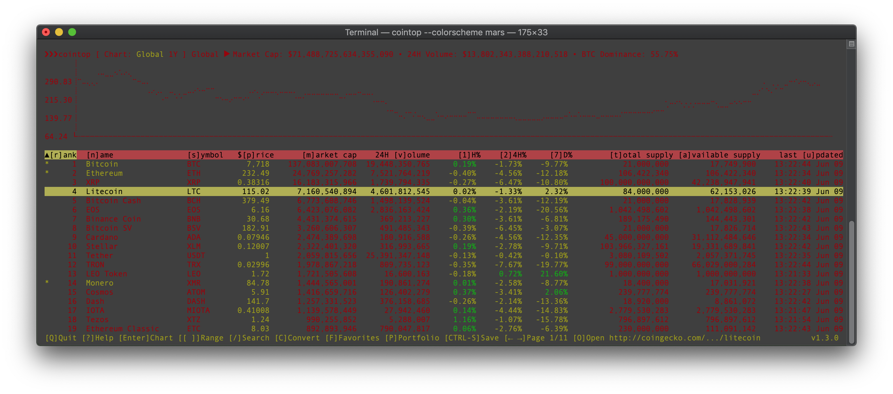
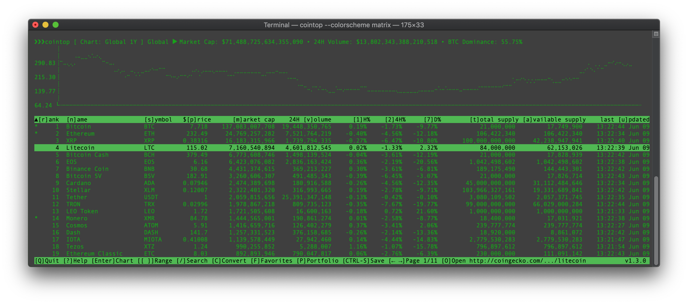
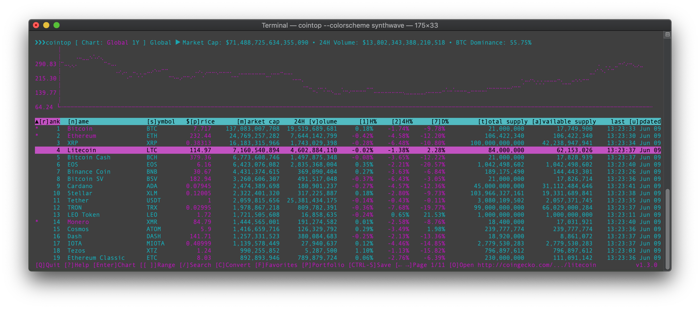
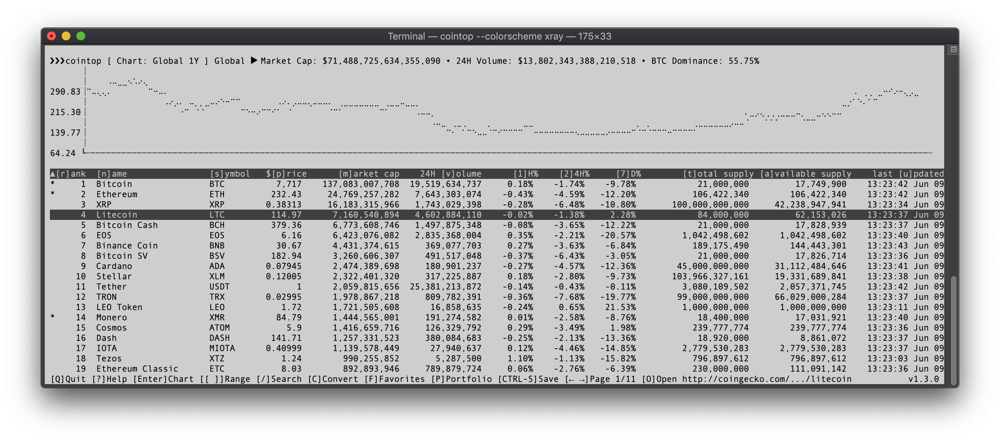

# cointop colors

> Standard colorschemes (themes) for [cointop](https://github.com/miguelmota/cointop/)

[](https://raw.githubusercontent.com/cointop-sh/colors/master/LICENSE)
[](#contributing)

## Contents

- [Installation](#installation)
- [Colorschemes](#colorschemes)
- [Contributing](#contributing)
- [License](#license)

## Installation

Clone into config directory:

```bash
$ cd ~/.cointop
$ git clone git@github.com:cointop-sh/colors.git
```

Edit `~/.cointop/config.toml` and set colorscheme:

```toml
colorscheme = "matrix"
```

## Colorschemes

In alphabetical order:

### [cointop](./cointop.toml)



### [crimson](./crimson.toml)


### [grayscale](./grayscale.toml)



### [homebrew](./homebrew.toml)



### [iceberg](./iceberg.toml)



### [mars](./mars.toml)



### [matrix](./matrix.toml)



### [synthwave](./synthwave.toml)



### [xray](./xray.toml)



## Contributing

If you have a cool and unique theme that you'd like to share, please fork and submit a PR!

Supported colors are:

- `black`
- `blue`
- `cyan`
- `green`
- `magenta`
- `red`
- `white`
- `yellow`

<!-- - xterm display hex colors; view [cheat sheet](https://jonasjacek.github.io/colors/) -->

## License

[MIT](LICENSE)